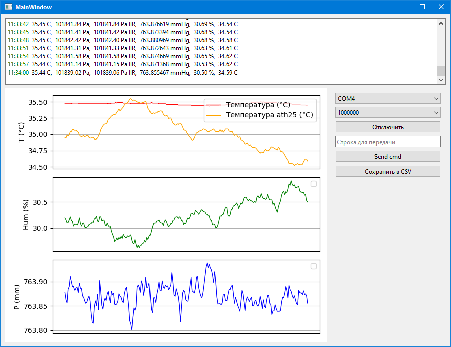

# Приложение для работы с COM-портом и визуализации данных на QT

Графическое приложение на основе PySide6 для взаимодействия с устройствами через COM-порт, визуализации данных с датчиков и их сохранения в CSV-файл.
(Аналогичная консольная утилита в подпапке /console_app)

## Основной функционал
- Подключение к устройству через COM-порт.
- Автоматический поиск устройства по VID и PID.
- Чтение данных с устройства в реальном времени.
- Визуализация данных с датчиков (температура, давление, влажность) в виде графиков.
- Сохранение данных в CSV-файл.
- Логирование событий в текстовом поле интерфейса.

## Установка и запуск

### Клонирование репозитория
```bash
git clone https://github.com/YuriyChecksum/stm32f407_RTOS_remote_control.git
cd stm32f407_RTOS_remote_control/Python
```

### Установка зависимостей

#### Если установлен чистый Python
```shell
# Обновление менеджера пакетов pip
python.exe -m pip install --upgrade pip

# Создание виртуального окружения в подпапке .venv
python -m venv .venv

# Активация виртуального окружения:
.venv\Scripts\activate.bat # для Windows
source .venv/bin/activate   # для Linux и MacOS.

# Установка зависимостей
python -m pip install -U -r requirements.txt
```

#### Если установлен пакетный менеджер UV
```shell
uv sync --no-cache
```

### Запуск приложения
```shell
python app.py
```

Или, если используется UV:
```shell
uv run app.py
```

### Установка UV под Windows
```shell
powershell -ExecutionPolicy ByPass -c "irm https://astral.sh/uv/install.ps1 | iex"
```

## Использование

### Подключение к устройству:
1. Выберите COM-порт из выпадающего списка или используйте автоматический выбор порта.
2. Установите скорость передачи данных (по умолчанию 1000000 бод).
3. Нажмите кнопку "Подключить".

### Визуализация данных:
После подключения данные с устройства будут отображаться в реальном времени на графиках:
- Температура (°C).
- Влажность (%).
- Давление (мм рт. ст.).

### Сохранение данных:
Нажмите кнопку "Сохранить в CSV", чтобы сохранить текущие данные в файл.

### Отправка команды:
Введите команду в текстовое поле и нажмите "Send cmd", чтобы отправить её на устройство.

### Логирование:
Все события и ошибки отображаются в текстовом поле логов.

## Формат данных
Пример строки данных, получаемой с устройства:
```
T: 28.57; P1: 100598.70; P2: 754.552302; H: 35.72; T2: 29.17
```

### Описание параметров:
- `T` — Температура (°C).
- `P1` — Давление (Па).
- `P2` — Давление (мм рт. ст.).
- `H` — Влажность (%).
- `T2` — Температура с другого датчика (°C).

## Пример графического интерфейса


## Зависимости
- PySide6
- pyserial
- matplotlib
