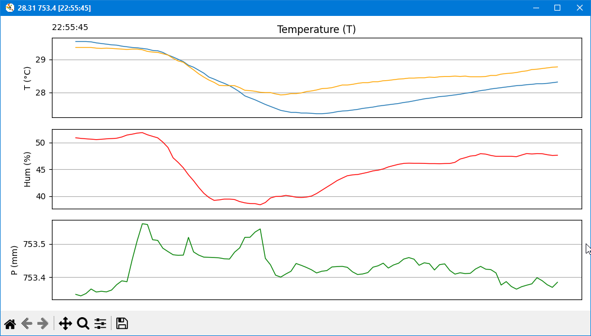

# Example Python script for exchange data with STM32 microcontroller

Пример кода взаимодействия программы на python с контроллером STM32F407 через com port.
- ```Python/main.py``` - скрипт чтения из контроллера и запись в файл ```BMP280_pressure.csv```
- ```Python/chart.py``` - строит график по содержимому в ```BMP280_pressure.csv```, автообновление графика по свежим данным.

## Как установить и запустить
### Clone repo
```bash
git clone https://github.com/YuriyChecksum/stm32f407_RTOS_remote_control.git
cd stm32f407_RTOS_remote_control/Python
```

### Если стоит чистый python
```shell
# обновим менеджер пакетов pip
python.exe -m pip install --upgrade pip

# Создадим виртуальное окружение в подпапке .venv
python -m venv .venv

# Чтобы начать пользоваться виртуальным окружением, необходимо его активировать:
.venv\Scripts\activate.bat # для Windows
source .venv/bin/activate   # для Linux и MacOS.

# Установим зависимости
python -m pip install -U -r requirements.txt

# Run
python main.py  # скрипт сбора данных и логирования в BMP280_pressure.csv
python chart.py # отслеживает .csv файл и строит графики
```

### Если установлен пакетный менеджер UV
```shell
uv sync --no-cache
uv run main.py
uv run chart.py
```

### Установка uv под windows
```shell
powershell -ExecutionPolicy ByPass -c "irm https://astral.sh/uv/install.ps1 | iex"
```

### Create requirements
```shell
# create requirements.txt
python -m pip freeze > requirements.txt
```
### Демо данные
В файле ```"BMP280_pressure_demo.csv"``` демонстрационные данные для построения графика.
Подхватится автоматически, если не найдёт файл ```"/Python/BMP280_pressure.csv"```

Форамат строки .csv
```
datetimenow, T, P, Piir, Pmm, Hum, T_ath25
Где:
  datetimenow - Дата и время
  T - Температура
  P - Давление
  Piir - Давление (после сглаживающего фильтра)
  Pmm - Давление в мм рт. ст.
  Hum - Влажность
  T_ath25 - Температура с датчика ATH25

Пример данных:
2025-03-15 05:06:17; 28,57;  100598,70;   98586,73; 754,552302;  35,72;  29,17;
2025-03-15 05:06:19; 28,57;  100600,11;  100559,84; 754,562878;  35,73;  29,18;
```

### Пример графика
