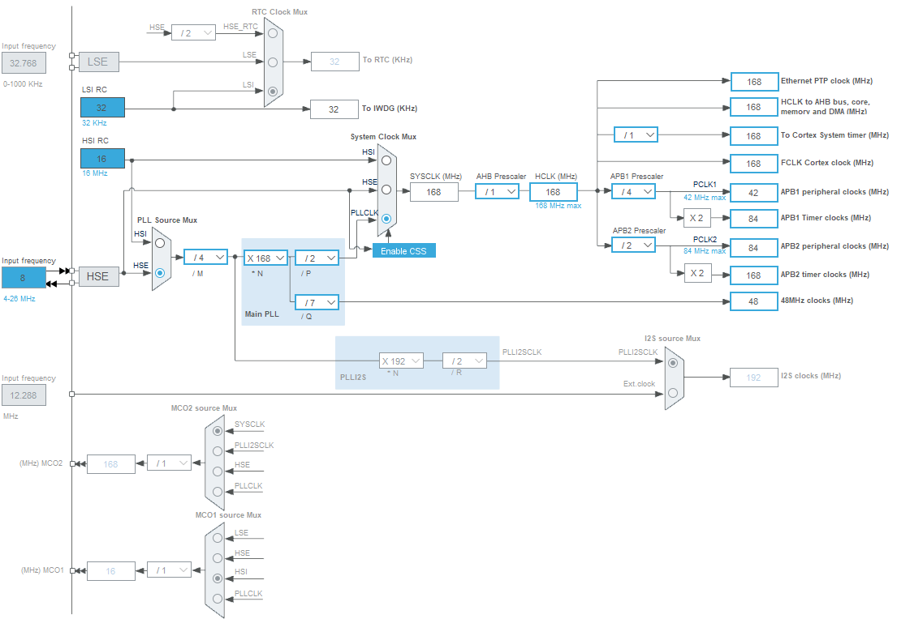

# stm32f407_RTOS_remote_control
Проект реализует интерфейс удалённого управлениия аппаратными модулями  микроконтроллера STM32 (ADC, DAC, I2C и тд), а так же связь с устройствами на шине i2c реализуя мост uart-i2c.
Это позволяет читать показания с различных датчиков, отлаживать алгоритмы опроса, а так же читать/писать микросхемы памяти типа 24C... сторонней программой, например на python.
Используется микроконтроллер ```STM32F407VE``` (Arm Cortex-M4 with DSP and FPU, 512 Kbyte, 168 MHz, 1 core) и ОС ```FreeRTOS``` для управления задачами.

Планировалось использовать как многофункциональное устройство для подключения разных датчиков и контроллеров, для которых дописываешь драйвер и можешь управлять с десктопа через COM порт.

## Управление
В папке ```Python``` лежит пример утилиты для реализации алгоритма управления и инструкция. Используется библиотека ```pyserial``` и своя обёртка над ней.

Для сложных алгоритмов лучше использовать ```python```, для простых функций можно вводить команды в терминале, типа pytty или YAT.

## F103 типа BluePill
Используя отладочные платы с разведённым USB типа BluePill на контроллере F103 или F401/411, в конфигурации STM32Cube подключить встроенный драйвер USBCDC и получим простой способ обмениваться данными, однако будут прерывания из-за переполнения буфера при больших пакетах. На каких скоростях будет заметно надо тестировать под конкретный камень.

## Реализованы драйвера для периферии:
- LPH8731 - LCD от Siemens, параллельный интерфейс, TFT,
- BMP280 - датчик атмосферного давления,
- MT6701 - Бесконтактный датчик угла поворота. Используется радиально намагниченный магнит,
- ATH25  - влажность и температура,
- Eeprom I2C,
- Buttons,
- Подсчёт CRC для разной перефирии и передачи данных.

## Подключение и управление устройствами
Сейчас реализован протокол управления устройствами по шине i2c. Легко дописать другие протоколы, например управление экранами, адресными LED лентами, CAN и тд.

Подключая свои устройства на шину i2c следующими командами через терминал можно писать и читать их регистры.
Используется USART2, скорость 1 000 000 bod.

## Команды для управления переферией через UART:
```
# Frame data format
'i2c' 'bus_addr7_hex'  'w/r' 'len_addr[0..2]' 'reg_addr16_hex' 'len_data16_hex' '*data_hex'
```
```
# Command write to 24C02 data 0x0A1B2C to addr 0x10
i2c 52 w 1 0010 0003 0A1B2C 
    i2c -> command 'i2c' read/write to i2c bus,
    52 -> device address 0x52,
    w -> write
    1 -> len address register 1 byte,
    0010 -> address register 0x10,
    0003 -> len data '0x03'
    0A1B2C -> data 3 bytes in hex string
```
```c
# Адреса устройств на шине i2c
#define I2C_ADDR_24C02  0x52  // AT24C02
#define I2C_ADDR_24C32  0x57  // AT24C32
#define I2C_ADDR_INA226 0x40  // INA226
#define I2C_ADDR_OLED   0x3C  // OLED
#define I2C_ADDR_DS3231 0x68  // RTC_DS3231
#define I2C_ADDR_ATH25  0x38  // ATH25
#define I2C_ADDR_BMP280 0x76  // BMP280
```
```
# 24C02
i2c 52 r 1 0000 0020
i2c 52 r 0 0000 0010

# 24C32
i2c 57 w 2 0010 0003 0A1B2C
i2c 57 r 2 0000 00ff

# DS3231 часы и будильник
i2c 68 r 1 0000 0013                       DS3231 read all registers
i2c 68 w 1 0000 0007 00000000000000        DS3231 clear datetime
i2c 68 w 1 0000 0007 00521800030423        DS3231 write datetime dt[0:6] c:m:h:00:d:m:y
i2c 68 w 1 0000 0003 005218                DS3231 write time dt[0:2] c:m:h

# INA226 - датчик тока прочитать регистр измерений тока и напряжения
i2c 40 r 1 0001 0002   INA226 SHUNT_VOLTAGE  sign16 (1 LSB = 2.5 uV) с шунтом R=0.1 Om
i2c 40 r 1 0002 0002   INA226 BUS_VOLTAGE  unsign16 (1 LSB = 1.25 mV)
```

Что-то может работать не полностью, так как переношу код частями из другово проекта. Необходимо доработать под себя!

### Clock


### Распиновка


### Пример графика на Python


### IDE
Использовалась ```STM32CubeIDE```
// Version: 1.15.1
// Build: 21094_20240412_1041
